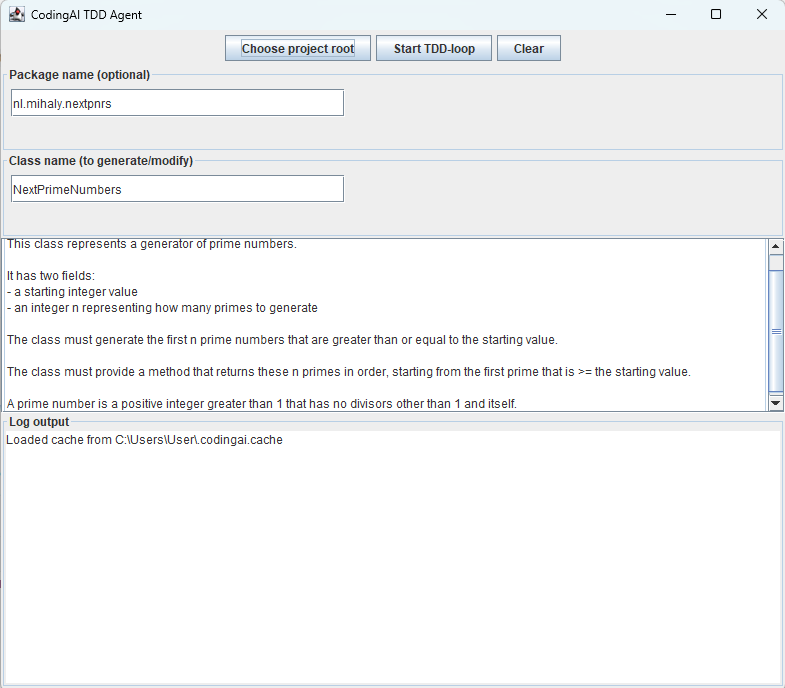
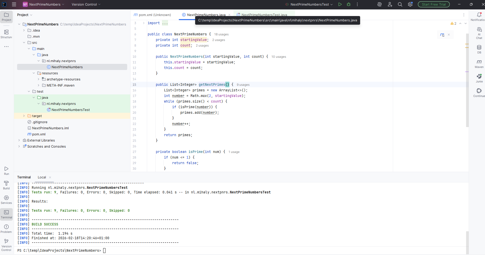

# CodingAI — AI‑Driven TDD Engine for Java

CodingAI is an experimental but powerful **AI‑driven TDD agent** that automatically generates Java classes based on:

- a **specification** describing the intended functionality  
- a **Maven project containing unit tests**  
- an iterative **Test‑Driven Development (TDD)** workflow  

The agent runs Maven tests, analyzes failures, generates code using an AI model, writes the Java class into the project, and repeats this process until **all tests pass**.

CodingAI is designed as a proof‑of‑concept for AI‑assisted software development, and it works surprisingly robustly and fully autonomously.

---

## 📸 GUI Screenshot



### How to use the GUI

1. **Select the Maven project root**  
   Choose the main directory of the Maven project where the Java class should be generated.  
   The project must follow the standard Maven directory structure.

2. **Enter the class name and package name**  
   This is the class that CodingAI will generate.

3. **Ensure a matching unit test class exists**  
   The test class must follow standard Maven conventions and must have the same base name.  
   Example:  
   - Class to generate: `PrimeNumbers`  
   - Test class: `PrimeNumbersTest`

4. **Provide a specification**  
   This ensures the generated class not only satisfies the unit tests but also implements the intended functionality.

5. **Start the TDD loop**  
   The bottom panel shows the log output.  
   CodingAI will run one or more iterations until all tests pass.  
   **Note:** If the class already exists, it will be overwritten.

### Example of a generated Java class inside a Maven project



---

## 🧱 Requirements

To use CodingAI, you need the following:

### **1. Java 17 or higher**
Required for both CodingAI and the target Maven project.

### **2. Maven installed**
On Windows, `mvn.cmd` must be available in your PATH, for example:

```
C:\Program Files\Maven\apache-maven-3.9.12\bin\
```

CodingAI invokes Maven using `ProcessBuilder`.

### **3. Ollama installed**
Download from: https://ollama.com

### **4. AI models**
CodingAI uses:

- `deepseek-coder-v2:16b` (primary model)  
- `deepseek-r1:70b` (fallback model)

Install them via:

```bash
ollama pull deepseek-coder-v2:16b
ollama pull deepseek-r1:70b
```
## 🔁 How the Feedback Loop Works

CodingAI is not a simple one‑shot code generator.  
It uses a true **iterative feedback loop**, driven by Maven test results, to refine the generated code until all tests pass.

The loop works as follows:

1. **Run Maven tests**  
   CodingAI executes `mvn test` inside the target project.

2. **Analyze the output**  
   The agent reads the full Maven console output and determines:
   - whether there are compilation errors
   - which tests failed
   - what assertion messages were produced
   - whether dependencies are missing
   - whether the build succeeded

3. **Generate a targeted AI prompt**  
   Based on the detected errors, CodingAI constructs a prompt containing:
   - the relevant parts of the Maven output
   - the class specification provided by the user
   - instructions to fix the failing behavior

   The AI does **not** receive structured test results;  
   instead, it sees the human‑readable Maven output (e.g.  
   “expected [11, 13, 17] but was [11, 12, 14]”).

4. **AI generates a new version of the class**  
   The agent extracts the Java class from the AI response and overwrites the existing file.

5. **Run Maven again**  
   The updated code is compiled and tested.

6. **Repeat until all tests pass**  
   The loop continues until Maven reports:
```
BUILD SUCCESS
Failures: 0
Errors: 0
```
This mechanism ensures that CodingAI behaves like a real TDD developer:  
it writes code, runs tests, reads failures, fixes the code, and repeats until everything is green.
